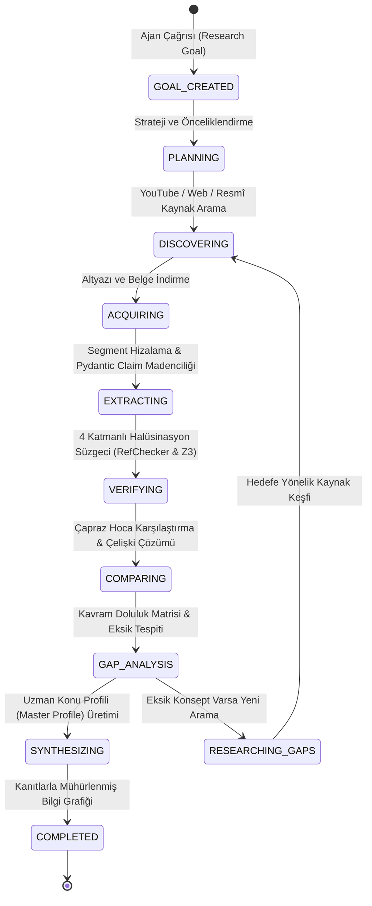

# 🔄 KPSS Super-Brain: Ajan İş Akışı ve Durum Makinesi (AGENT_FLOW.md)

Bu doküman, `ResearchAgent` sınıfının ve `ToolRegistry` araçlarının otonom araştırma döngüsünü, durum geçişlerini ve durma koşullarını (Stop Conditions) belgeler.

---

## 1. Araştırma Durum Makinesi (Research State Machine)



---

## 2. Durum Geçişleri ve Olay Kaydı

Her durum geçişi `research_events` tablosunda atomik olarak saklanır:

```json
{
  "event_id": "evt_4b8f2a10",
  "research_id": "res_8c9d1e2f",
  "event_type": "STATE_TRANSITION",
  "from_state": "EXTRACTING",
  "to_state": "VERIFYING",
  "details_json": {
    "extracted_claims_count": 14,
    "segments_analyzed": 5
  },
  "timestamp": "2026-08-25T21:30:00"
}
```

---

## 3. Durma Koşulları (Stop Conditions)

Ajan sonsuz döngüye girmez. Aşağıdaki kriterler sağlandığında kontrollü biçimde durur:

1. **Hedef Kapsam (Target Coverage)**:
   - Konu hakimiyet skoru $\ge 0.85$ (veya belirlenen hedef).
2. **Doğrulama Eşiği (Verification Threshold)**:
   - Tüm kritik iddiaların RefChecker ve Z3 SMT formal çözücüden başarıyla geçmesi.
3. **Çelişki Durumu (Zero High-Severity Contradictions)**:
   - Yüksek öncelikli çözümlenmemiş çelişki sayısının $0$ olması.
4. **Güvenlik Sınırları**:
   - Maksimum adım sayısı ($10$ adım) veya zaman aşımı limitine ulaşıldığında açık durum raporu ile durur.
